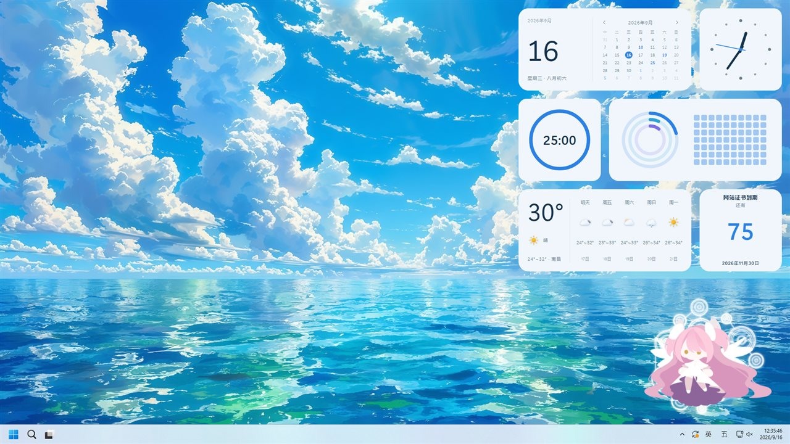
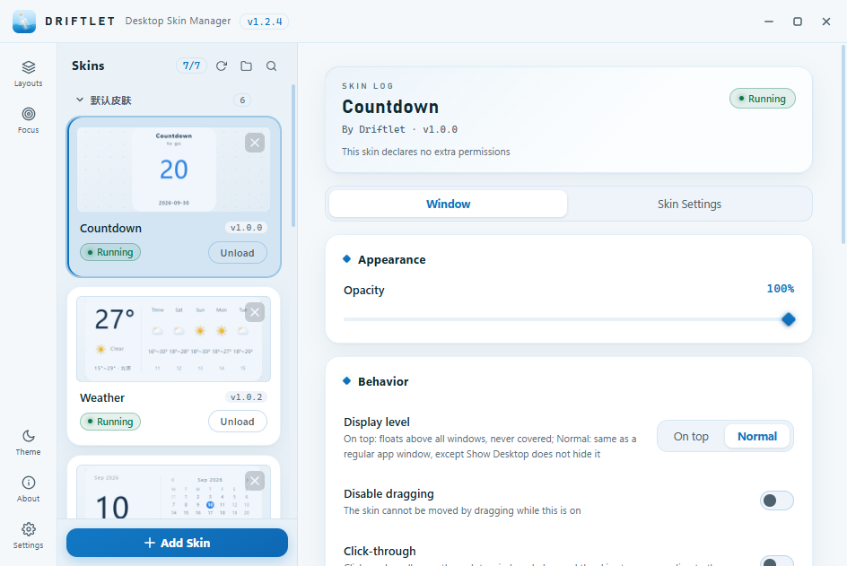
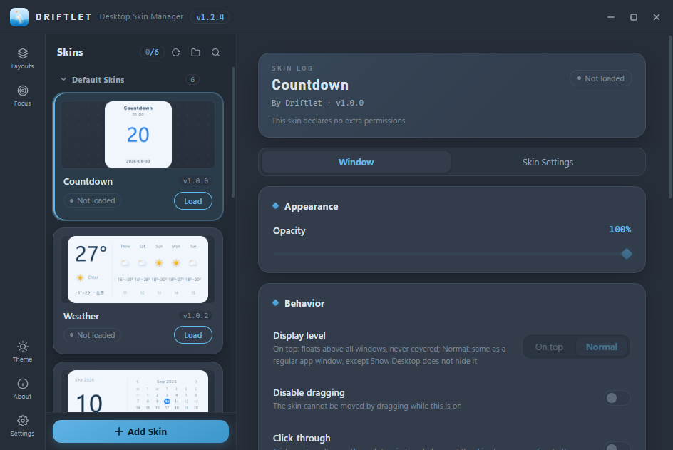
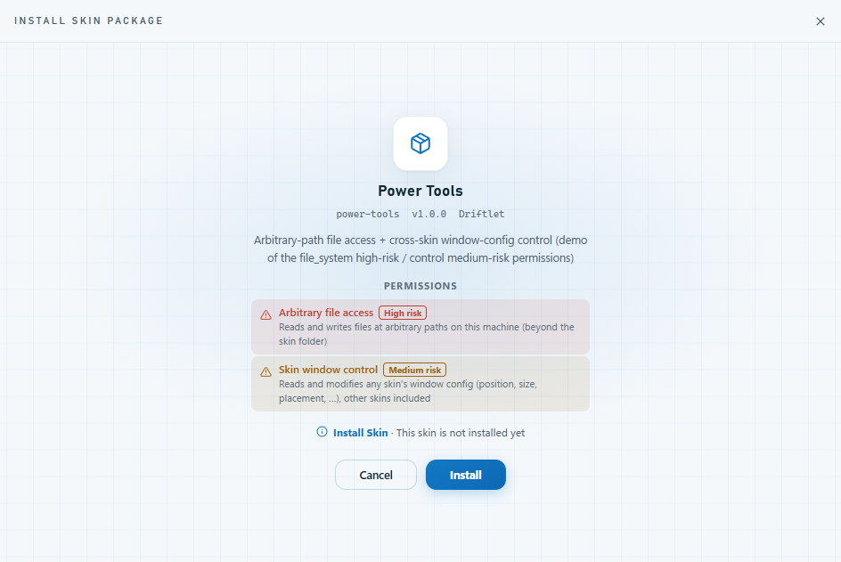
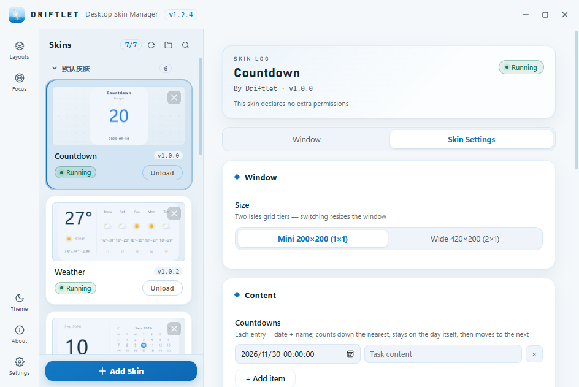
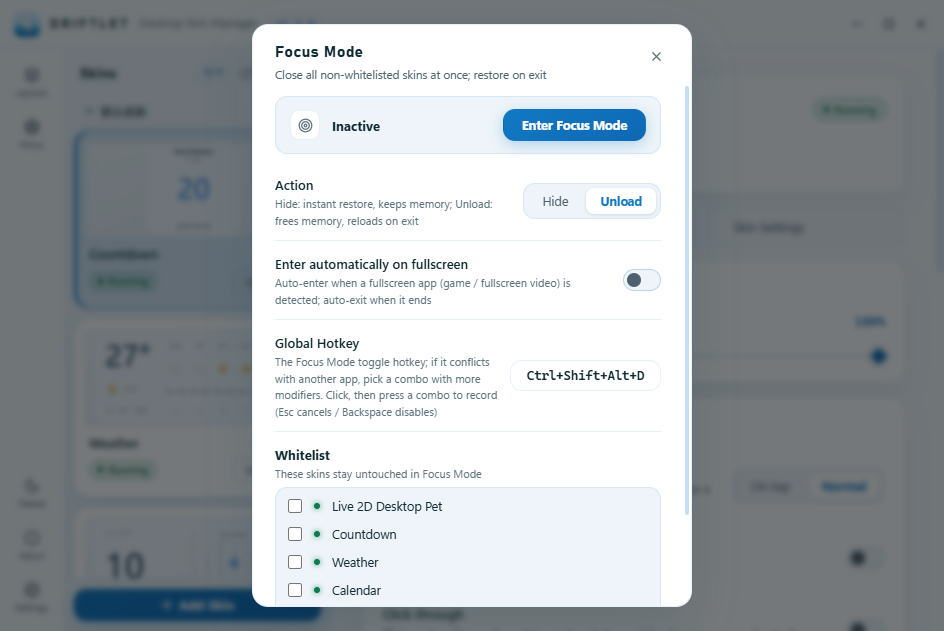
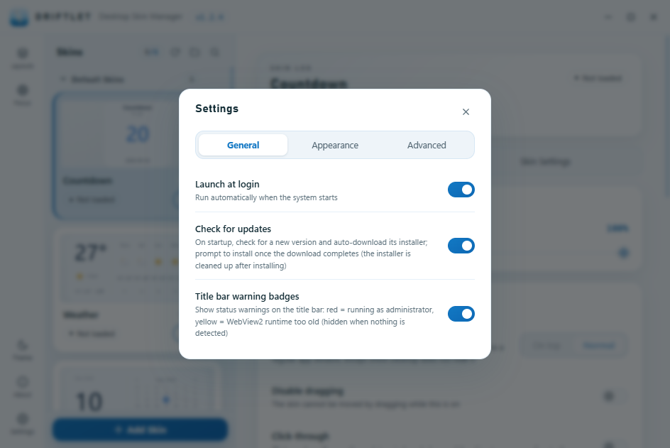
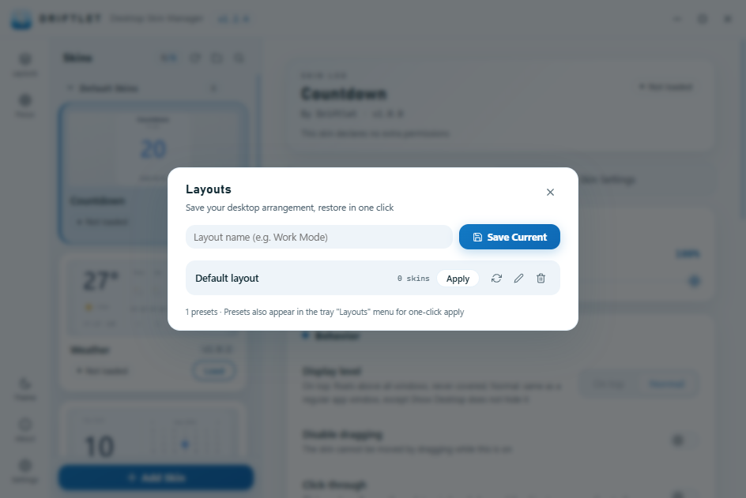

# Driftlet

> [中文版](README.md) | English

[](https://github.com/xiaochengzina/Driftlet/actions/workflows/ci.yml) [](LICENSE) [](https://github.com/xiaochengzina/Driftlet/releases) 

A Windows desktop skin manager built with Tauri 2 + Vite / vanilla JavaScript. It presents web pages as desktop widgets, offering transparent windows, frameless windows, always on top, and pin to desktop.



| Light Theme | Dark Theme |
|:---:|:---:|
|  |  |

---

## Features

- Install, uninstall, load, and reload skins
- Install/update skins from `.dskin` skin packages (zip format); updates preserve user settings data
- Double-click a `.dskin` file to bring up the install wizard directly (the installer registers the file association)
- Skin permission model: sensitive capabilities must be declared in `permissions` in `skin.json` (12 kinds: registry / Shell / system control (open links / power & Recycle Bin) / clipboard / microphone / arbitrary-path file access / skin window control / media control / notifications / system info / network requests / opening web links); the install wizard lists them one by one and flags them with a three-tier high/medium/low risk grading (see "Security Model")

| Install Wizard |
|:---:|
|  |

- Custom skin settings: declare config items in `skin.json` (23 control types + groups + descriptions); the config panel is generated automatically
- Adjust a skin's opacity, position, size, and zoom (the "Window" tab can enable resize-by-dragging: shows a frame hint, drag edges/corners to resize directly; zoom scales the whole window and its content from 50%–200%)
- Always on top / pin to desktop (mutually exclusive, pin to desktop by default), disable dragging
- Click-through (per-skin toggle on the "Window" tab, off by default): clicks and scrolls pass through to the window or desktop below — combined with pin-to-desktop the skin becomes a pure display widget
- Capture preview images for skins
- Tray icon management; closing the main window destroys it to reclaim the renderer process memory (~80 MB) — summoning it back from the tray rebuilds the window (page reload ~1 s)
- Autostart, dark/light theme switching
- Right-click a skin window to open the skin menu (open config / refresh / hide / unload, plus a window-behavior quick-toggle section: always-on-top / lock position / click-through / resize by dragging / edge snapping; skins can register custom menu items)
- Focus Mode: one click (nav-bar panel / global hotkey / tray check) enters a do-not-disturb desktop — by the chosen action tier it hides (default; instant restore, state kept) or unloads (reclaims all memory) every non-whitelisted skin, and restores from the entry snapshot on exit; the whitelist exempts checked skins from both tiers; optionally auto-enters when a fullscreen app (game / fullscreen video) is detected and auto-exits 5 s after it ends; mode state and snapshot are persisted, so a crash or quit never loses the restore point. The hotkey defaults to Ctrl+Shift+Alt+D, changeable or disabled in the Focus Mode panel

| Skin Settings | Focus Mode |
|:---:|:---:|
|  |  |

- Tray "Skin Visibility" submenu: one checkable row per loaded skin, click to toggle that skin's visibility, with the check state synced in real time with the editor, the right-click menu, and the global hotkey; Alt+F4 on a skin window only hides it (never destroys) — call it back via this check or the editor button
- Per-skin visibility shortcut: each skin can record a combo in the editor to toggle just that skin's visibility (saving is refused when it duplicates the global hotkey / another skin's combo or is taken by another program)
- Browser refresh/navigation shortcuts like F5 are blocked in both the manager and skin windows — pages cannot be refreshed by keystroke; the window lifecycle belongs entirely to the manager
- Layout backup: export/import all settings and skins as a single zip from the Settings page (for migration or sharing; the import review shows the permission declarations of the skins inside, same conventions as the install wizard; selective import supported — checking skins in the review list switches to merge mode, replacing only the checked skins and merging their config and layouts, everything else untouched)
- Layout presets: save the current desktop state (load set + each skin's position/size/visibility) as a named preset and apply it with one click; the tray menu lists presets too

| Settings | Layout Presets |
|:---:|:---:|
|  |  |

- Skin groups: custom grouping with fold/unfold, rename and checkbox-based member editing; batch load/unload/hide/show for all members of a group, or delete a whole group together with its skins (two-step confirmation)
- Skin duplication: create an independent copy of a skin (separate settings/preview/permissions), and pull the source's latest content into the copy with one click after the source is updated
- Startup update check (on by default, can be turned off in Settings): once a new GitHub release is found it prompts immediately and downloads the installer in the background — direct connection and acceleration mirrors race in parallel with segmented downloading (slow/failed direct downloads no longer force a manual trip to the web page; the official SHA-256 of the installer is verified throughout), a progress bar shows during the download, and the primary button turns into "Install now" when done; only on download failure does it fall back to the "Go to download page" flow
- About panel (pinned at the bottom of the nav bar): app version, the public repository link (one click to open in the system browser), the full user agreement (same source as the installer's license page, shown in Chinese or English following the UI language), and a manual "Check for updates" entry

---

## Requirements

- Windows 10/11 (some features rely on the Win32 API)
- Node.js
- Rust / Cargo (required by Tauri 2)
- WebView2 Runtime (bundled with Win11; must be ≥ 111 — an evergreen build from March 2023 or later, the container-queries/color-mix baseline for the bundled skins. The installer auto-upgrades an older runtime on install/update; if it somehow went stale afterwards, a startup notice offers a one-click update; **fully offline machines**: the Releases page also carries a `-offline` installer with the full runtime embedded — zero network needed throughout, and an already-installed older runtime is upgraded in place from it, never touching the online updater)

---

## Quick Start

```bash
# Clone the repository
git clone <repo-url>
cd Driftlet

# Install dependencies
npm install

# Development mode
npm run tauri dev

# Build the production bundle
npm run tauri build
```

---

## Project Structure

```
├── src/                  # Frontend source
│   ├── js/               # Vanilla JS (app.js entry)
│   └── css/              # Styles
├── src-tauri/src/        # Rust backend
│   ├── commands.rs       # Tauri IPC commands (manager commands uniformly guarded by require_manager)
│   ├── lib.rs            # App startup, state, auto-loading
│   ├── desktop.rs        # Windows "pin to desktop" implementation
│   ├── window/factory.rs # Skin window creation / frameless subclassing
│   ├── window/snap.rs    # Edge snapping (rewrites coordinates in place during WM_MOVING)
│   ├── skin/             # Skin scanning, loading, config, .dskin package installation
│   └── skin_api/         # System info and sensitive-capability commands callable by skins (require_perm authorization)
├── src-tauri/capabilities/ # Window permissions: default.json (main window) / log.json (log window) / skin.json (skin windows, empty permissions)
├── examples/             # Official skin family "Isles" sources (design spec / shared base / isles-* skins, bundled into the installer as the "Default Skins" group)
├── demos/                # Demo skin sources (reference; shipped as standalone .dskin, not bundled)
│   ├── controls-demo/        # Demo of all settings controls (bilingual; UI language follows the manager)
│   ├── sys-monitor/          # System monitor (the read-only system-info API set)
│   ├── media-hub/            # Media console (volume / media / spectrum / notifications)
│   ├── toolbox/              # Local toolbox (clipboard / files / registry / commands / links / power / settings read-write)
│   ├── deepseek-balance/     # DeepSeek balance auto-query (networked-skin reference; low-balance alert + notification + top-up; API key stored via a password field)
│   ├── power-tools/          # Permission-capability demo (arbitrary-path file access file_system high-risk / cross-skin window-config control control medium-risk)
│   ├── web-view/             # Web view (generic skin embedding any site page in an iframe: local shell + full bridge, zero permissions)
│   ├── driftlet.js           # Optional wrapper: named command functions + event helpers (copy into a skin folder)
│   └── driftlet.d.ts         # Type definitions for the bridge and all commands (editor autocomplete)
├── tools/
│   ├── pack-skin.exe     # Skin packaging tool (standalone, generates .dskin)
│   ├── pack-skin/        # Packaging tool source (Rust)
│   └── win32-probes/     # Windows window probing scripts (for debugging)
└── docs/                 # Development docs
    ├── 皮肤开发指南.md    # Interface docs and specs for skin creators
    ├── skin-development-guide.md   # Skin development guide (English)
    ├── 关键机制.md        # Window / desktop layer implementation details (do not regress)
    ├── critical-mechanisms.md      # Critical mechanisms (English counterpart)
    ├── 架构与机制总览.md  # Developer overview (architecture / runtime mechanisms / design decisions, merging critical mechanisms)
    └── architecture-and-mechanisms.md  # Architecture & mechanisms overview (English)
```

---

## Skin Development

> For the full interface documentation and specs, see [`docs/skin-development-guide.md`](docs/skin-development-guide.md); this section is a quick start.

In development builds (`npm run tauri dev`), a loaded skin can reload automatically when its files are saved (300 ms debounce) — no manual right-click refresh needed; hot reload is off by default and takes effect once enabled on the Settings page.

A skin is a standalone folder containing at least:

```
my-skin/
├── skin.json        # Skin metadata / window defaults
├── index.html       # Entry page
└── ...              # Images, css, js, and other resources (all inside the skin folder)
```

### skin.json Example

```json
{
  "id": "my-skin",
  "name_zh": "我的皮肤",
  "name_en": "My Skin",
  "version": "1.0.0",
  "author": "You",
  "description_zh": "一个简单的桌面挂件",
  "description_en": "A simple desktop widget",
  "entry": "index.html",
  "window": {
    "width": 300,
    "height": 200,
    "transparent": true,
    "always_on_top": false,
    "on_desktop": true,
    "resizable": false,
    "zoom": 1.0,
    "opacity": 0.95
  }
}
```

### Draggable Region

Add the `.drag-region` class to an element in the HTML to make it drag the skin window:

```html
<div class="drag-region">
  <!-- Content here can drag the window -->
</div>
```

### Adaptive Layout

The skin window size can be changed by the user at any time (via values in the manager panel, or by dragging the frame when `resizable` is enabled), so the skin layout must be adaptive: elements must not overflow the window's visible area, and no window-level scrollbars may appear. For the spec and the two paradigms (scale-to-fit / fill + internal scrolling), see `docs/skin-development-guide.md` §3.3; the example skin has been adapted accordingly.

### Calling Backend Commands

Inside a skin, backend commands are called through the injected bridge (recommended entry `window.driftlet`; `window.__DESK_PP__` is the same object under its legacy name, kept forever):

```js
if (window.driftlet?.invoke) {
  const [cpu] = await window.driftlet.invoke('get_cpu_info');
  console.log(cpu.usage); // total usage %; rate readings return 0 on the first call (baseline) — poll once per second
}
```

The optional wrapper `demos/driftlet.js` turns commands into named functions like `Driftlet.getCpuInfo()` (with `driftlet.d.ts` for editor autocomplete); the full command list and contracts are in `docs/skin-development-guide.md` chapter 5.

### Custom Settings

A skin can declare config items with the `settings` array in `skin.json`; the manager's config panel will show a dedicated "Skin Settings" tab, automatically generating the corresponding controls from the declarations, with values persisted in the global config:

```json
"settings": [
  { "key": "title",        "type": "text",        "label_en": "Title",       "default": "Hello" },
  { "key": "notes",        "type": "longtext",    "label_en": "Notes",       "default": "" },
  { "key": "alarm_time",   "type": "time",        "label_en": "Alarm Time",  "default": "07:30" },
  { "key": "start_date",   "type": "date",        "label_en": "Start Date",  "default": "2026-01-01" },
  { "key": "show_seconds", "type": "boolean",     "label_en": "Show Seconds","default": true },
  { "key": "features",     "type": "multiselect", "label_en": "Enabled Features", "default": ["a"],
    "options": [ { "value": "a", "label_en": "Feature A" }, { "value": "b", "label_en": "Feature B" } ] },
  { "key": "mode",         "type": "radio",       "label_en": "Mode",        "default": "auto",
    "options": [ { "value": "day", "label_en": "Day" }, { "value": "night", "label_en": "Night" }, { "value": "auto" } ] },
  { "key": "accent_color", "type": "palette",     "label_en": "Accent Color","default": "#ff3333",
    "options": [ { "value": "#ff3333" }, { "value": "#4da3ff" } ] },
  { "key": "active_range", "type": "timerange",   "label_en": "Active Range",
    "default": { "start": "2026-07-20 12:00:00", "end": "2026-08-20 00:00:00" } },
  { "key": "level",        "type": "slider",      "label_en": "Intensity",   "default": 60, "min": 0, "max": 100, "step": 1 },
  { "key": "refresh_ms",   "type": "number",      "label_en": "Refresh Interval", "default": 1000, "min": 100, "max": 10000 },
  { "key": "tasks",        "type": "tasklist",    "label_en": "Task List",   "default": ["Sample task"] }
]
```

Supported `type` values and value formats:

| type | Control | Value Format | Notes |
|------|---------|--------------|-------|
| `text` | Short text input | `"string"` | ≤256 chars |
| `longtext` | Long text input | `"string"` | Multi-line, ≤4000 chars |
| `password` | Password input (masked) | `"string"` | ≤256 chars; the value is not injected into the page — see the note below the table for how to read it |
| `time` | Time picker (24h, second precision) | `"HH:MM"` or `"HH:MM:SS"` | |
| `date` | Date picker | `"YYYY-MM-DD"` | |
| `datetime` | Date-time picker | `"YYYY-MM-DD HH:MM:SS"` | Empty string = unset |
| `boolean` | Toggle switch | `true / false` | |
| `multiselect` | Multi-toggle group | `["a","b"]` | Requires `options`; the value is a subset of the selected items |
| `radio` | Exclusive toggle group | `"a"` | Requires `options`; only one per group |
| `weekdays` | Weekday picker | `["mon","wed"]` | Multi-select Mon–Sun, fixed options |
| `select` | Dropdown select | `"a"` | Requires `options` |
| `font` | Font picker | `"Microsoft YaHei UI"` | Enumerates installed system fonts; empty string = default |
| `palette` | Palette | `"#rrggbb"` or `"#rrggbbaa"` | `options` as preset colors (optional; includes custom color picking and an opacity slider) |
| `number` | Number input | `number` | Optional `min` / `max` / `step` |
| `slider` | Slider | `number` | Optional `min` / `max` / `step`, defaults 0/100/1 |
| `stepper` | Number stepper | `number` | −/+ buttons step by `step` (default 1); optional `min` / `max` (buttons disable at the bounds) |
| `timerange` | Time range (second precision) | `{ "start": "YYYY-MM-DD HH:MM:SS", "end": "..." }` | Empty string means unset |
| `tasklist` | Task list (add/delete/edit) | `["Item 1","Item 2"]` | |
| `todolist` | Todo list (checkable) | `[{ "text": "...", "done": true }]` | Skins can write back via `skin_set_setting` |
| `datetasklist` | Dated task list | `[{ "time": "YYYY-MM-DD HH:MM:SS", "text": "..." }]` | Each task carries a date-time; time may be empty |
| `file` | File picker | `"D:\\pics\\cat.png"` | The manager opens the system dialog; the value is an absolute path (≤1024 chars), empty string = unset; `filters` restrict extensions |
| `directory` | Folder picker | `"D:\\data"` | Same, for folders; `filters` ignored |
| `gpu_adapter` | GPU adapter picker | `"0x0001A2B3_0x0000F0E1"` | The manager enumerates the machine's GPUs at render time to build the dropdown; value = LUID (stable identifier), empty string = first entry (auto) |

Values of type `password` are **not baked into the page with the bridge's `settings`** (all skins share the same origin under skin://, so anything injected into the page could be scraped by other skins); instead, read them on demand inside the skin with the `skin_get_setting` command — `await driftlet.invoke('skin_get_setting', { key: 'my_key' })`. Identity is taken from the calling window, so a skin can only read its own values.

The `label_zh` / `label_en` of each `options` entry may be omitted, falling back to displaying the `value`; each setting can also carry a `description_zh` / `description_en` note shown below the control's label (text fields come in `*_zh` / `*_en` pairs — the UI language's field wins, missing falls back to the other; the legacy unsuffixed names `label` / `description` are still accepted, see §4.5 of `docs/skin-development-guide.md`):

```json
{ "key": "level", "type": "slider", "label_en": "Intensity", "description_en": "0 to 100; affects the particle count", "default": 60 }
```

### Groups

Settings can specify a group name with `group_zh` / `group_en` (the legacy unsuffixed `group` is still accepted); the "Skin Settings" tab places controls of the same group into one card (consistent with the section style of the "Window" tab). Groups are ordered by first appearance; controls without a group name go into the untitled card at the top:

```json
"settings": [
  { "key": "title", "type": "text", "label_en": "Title", "group_en": "Text", "default": "Hello" },
  { "key": "notes", "type": "longtext", "label_en": "Notes", "group_en": "Text", "default": "" },
  { "key": "accent_color", "type": "palette", "label_en": "Accent Color", "group_en": "Appearance", "default": "#ff3333" }
]
```

Reading and listening inside a skin:

```js
// Initial values: baked in by the injected bridge before the page loads
const settings = window.driftlet?.settings || {};
console.log(settings.accent_color);

// Runtime changes: pushed in real time when settings change in the manager, no reload needed
document.addEventListener('desk-setting-changed', (e) => {
  const { key, value } = e.detail;
  // Apply the new value...
});
```

Reference example: `demos/controls-demo` (demo of all 23 control types; the UI language follows the manager).

### Installing Skins

1. In the manager, click "+ Add Skin" and choose a `.dskin` skin package (user settings data is preserved on update).
2. With the installed build, you can also **double-click a `.dskin` file** directly: it launches Driftlet and pops up the install wizard; confirm to install (the file association is registered by the installer; the portable exe has no such entry).
3. During development, you can copy the skin folder directly into `<install dir>\skins\`.

A `.dskin` is just the skin folder zipped up (with `skin.json` at the root declaring `id`/`version`) and renamed; skin authors can use the standalone packaging tool `tools/pack-skin.exe` (no installation, no Node.js / Rust environment needed) to generate and validate one in a single step:

```
tools\pack-skin.exe <skin folder> [output dir]
```

See `docs/skin-development-guide.md` §8 for details.

---

## Security Model

A third-party skin is **networked local code** (a full Chromium web page + backend command calls) — treat it with that trust model. Driftlet's lines of defense:

- **No administrator rights needed**: every capability works as a standard user (the manifest is asInvoker); if launched from an elevated terminal/launcher, the app notifies you once (consequences: shell-permissioned skins can silently run commands with full administrator rights; Explorer→manager .dskin drag is blocked — double-click or the file picker work instead) — "Yes" = continue and never ask again, "No" = exit (`DRIFTLET_ALLOW_ELEVATED=1` also opts out; debug builds skip the notice by default). No automatic demotion: the scheduled-task route trips behavioral AV detection and token APIs require admin privileges that standard users elevated via UAC don't have — both routes were field-tested and removed.

- **Permission declaration**: 12 kinds of sensitive capabilities — registry, Shell, system control (open links / lock / sleep / shutdown / empty Recycle Bin), clipboard, microphone, arbitrary-path file read/write (`file_system`), cross-skin window-config & lifecycle control (`control`), media reads & control (`media`), system notifications (`notify`), read-only system info (`sys_info`), network requests (`network`), and opening web links (`open_link`) — must be declared in `permissions` in `skin.json` before they can be called, and the backend enforces per-command checks; the install wizard lists each declaration with a three-tier grading (high risk `shell` / `system` / `file_system` in red, medium risk `registry` / `clipboard` / `mic` / `control` in yellow, low risk `media` / `notify` / `sys_info` / `network` / `open_link` in blue). Link opening accepts only an http(s)/mailto/ms-settings URI whitelist — the local-path arm was removed entirely (an executable-extension blacklist is negative enumeration that can never keep up with the execution surface); skins that genuinely need to open local files declare the `shell` permission instead.
- **Manager commands are callable only from the manager window**: all management commands (load / unload / settings, etc.) verify the caller window's identity; calls from skin windows are always rejected (except three harmless commands: dragging, frame resizing, and the right-click menu). Every IPC command is registered with its caller tier in the policy table at `src-tauri/src/policy.rs`, and a completeness test enforces "a new command must be registered and carry the matching gate in its body" — a missing gate fails the build instead of relying on human review.
- **Zero grants for skin windows**: skin windows get no Tauri core/plugin permissions from capabilities; they can only reach backend commands through the injected bridge `__DESK_PP__.invoke`. 
- **File sandbox**: a skin's file reads/writes are confined to its own folder (absolute paths and `..` escapes rejected); `skin.json` / `settings.json` are write- and delete-protected. Even a skin holding `file_system` cannot mutate the app data roots (skins/config), the update directory, or the program directory — blocking silent self-escalation via skin.json edits and tampering with files the host later executes (installer / exe / dll).
- **Update-channel integrity**: the auto-downloaded installer's SHA-256 is recorded at download time (inside the version marker), and "Install now" re-verifies marker completeness + a version newer than the running one + a matching file hash before executing — the trusted "install the official update" action can never execute an installer rewritten by a third party.
- **Cross-skin isolation of settings values**: `settings.json` is intercepted by the skin:// protocol (including 8.3 short-name, ADS, and other bypass tricks), so skin A cannot read skin B's settings; `password` values never land on the page and are dispensed by `skin_get_setting` based on window identity.
- **`.dskin` install hardening**: extraction guards against zip-slip and zip bombs (metered by actual decompressed bytes); size/file-count limits 256MB / 1GB / 10000; staged, rollback-style installation that leaves the old version intact on failure.

---

## Code signing policy

Installers published to GitHub Releases are code-signed through SignPath (effective from the first release after it is enabled; verify via the installer's "Properties → Digital Signatures" — the publisher is shown as SignPath Foundation).

- Free code signing provided by [SignPath.io](https://about.signpath.io), certificate by [SignPath Foundation](https://signpath.org)
- Verifiable builds: signing happens only inside the public repository's GitHub Actions workflow (`.github/workflows/release.yml`); every signed artifact maps to a public commit, so anyone can compare source and binary.
- Team roles (currently a solo project): Committers and reviewers: [@xiaochengzina](https://github.com/xiaochengzina); Approvers (manual approval of each signing request): [@xiaochengzina](https://github.com/xiaochengzina).
- Privacy policy: see [PRIVACY.md](PRIVACY.md).

---

## Runtime Data Locations

All data lives alongside the install directory (portable mode):

- Skins directory: `<install dir>\skins\`
- Global config: `<install dir>\config\config.json` (Window-tab data and global settings)
- Skin settings values: `<install dir>\skins\<skin id>\settings.json` (user values from the "Skin Settings" tab; travels with the skin folder and is preserved when the skin is updated)

Note: configs stored by older versions under `%APPDATA%\com.driftlet.app\` are migrated automatically on first launch; if the install directory is not writable (e.g., a protected Program Files location), the app falls back to `%APPDATA%\com.driftlet.app\`.

---

## Notes

- "Always on top" and "pin to desktop" are mutually exclusive — one of them is always active, defaulting to "pin to desktop".
- Skin windows stay frameless via a custom Win32 subclass; read `docs/critical-mechanisms.md` (English counterpart of the Chinese `docs/关键机制.md`) before touching any window / desktop layer code.
- Skin resources are all loaded through the custom `skin://` protocol; put any external file references inside the skin folder.

---

## Dev / Build Commands

```bash
npm run dev           # Start the Vite frontend only
npm run build         # Build the frontend to dist/
npm run tauri dev     # Development mode (frontend + Tauri)
npm run tauri build   # Production installer build
npm run build:offline # Offline installer (full WebView2 runtime embedded; needs network once at build time; preserves any existing standard build and renames the output with a <-offline> suffix — the two never overwrite each other)
```

Installer artifacts (NSIS only, `bundle.targets = ["nsis"]`; the installer is Chinese-English bilingual and automatically follows the system UI language):

- NSIS: `src-tauri/target/release/bundle/nsis/Driftlet_<version>_x64-setup.exe` (the offline variant is `..._x64-setup-offline.exe`)

Note: `nsis.languages = ["English", "SimpChinese"]` — at runtime the installer matches the system language automatically, falling back to the **first** entry in the array when there is no match, so English must come first (Chinese systems → Simplified Chinese, everything else → English). An MSI used to be produced as well; it is no longer generated.

Backend-only checks:

```bash
cd src-tauri
cargo check
cargo build --release
```
